# GP Drawing Desk documentation

## Panels and additionals Gizmos which comes with addon

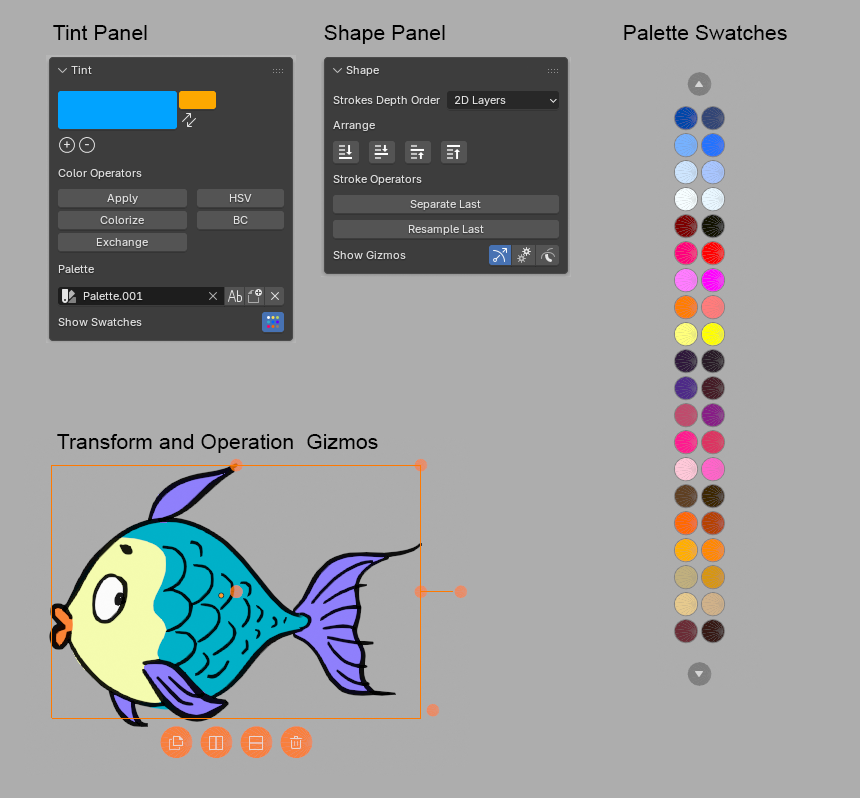

## Tint panel

### Brush Color

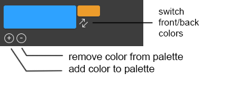
### Color operators

Select strokes and change its color using different operators.

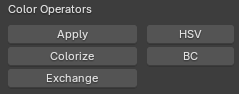

After executing operator you will find its options (working live) in the Adjust Last Operation panel in the left bottom corner of 3d View.

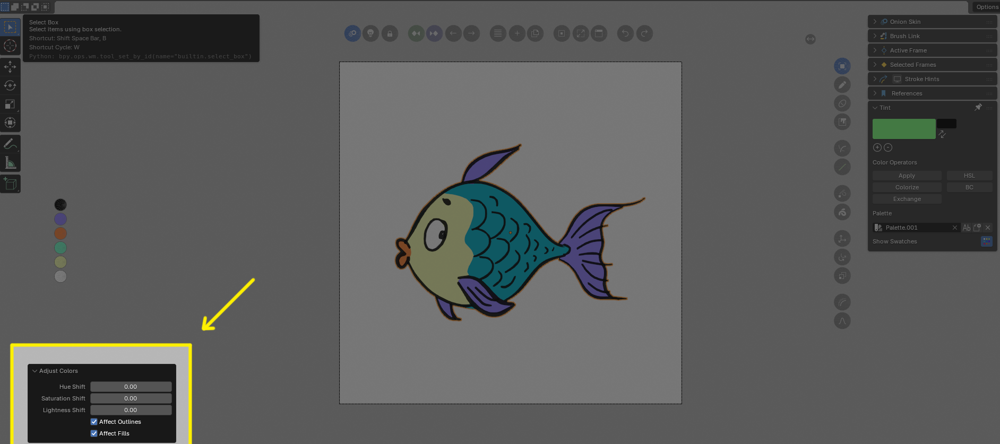
#### Apply 
Applies current brush color onto selected strokes.
If you Apply color without any key pressed it applies to **fills and outlines**
If you want to apply color to **fills** only use **CONTROL** key modifier. 
If you want to apply color to **outlines** only use **SHIFT** key modifier. 

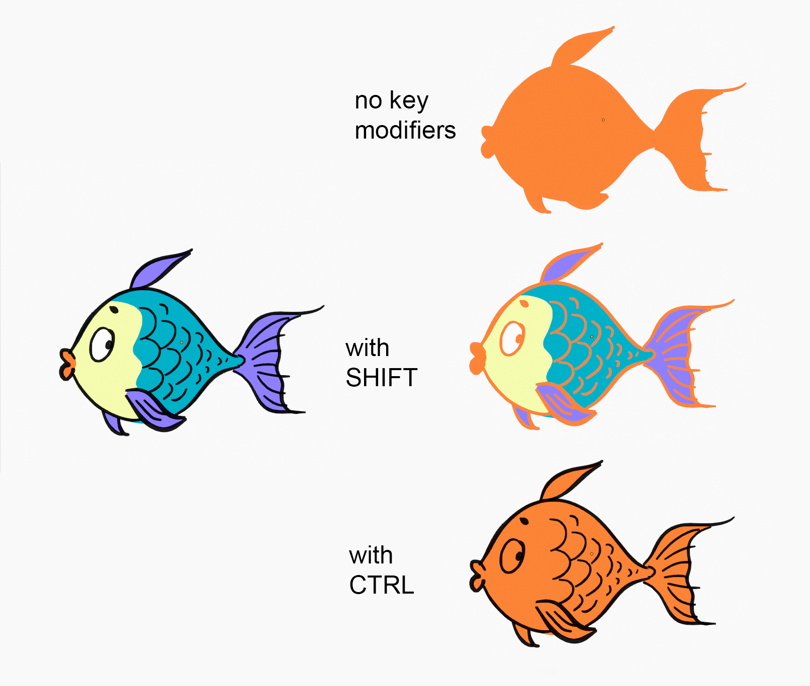

#### Colorize
Apply color, keeping lightness of drawing
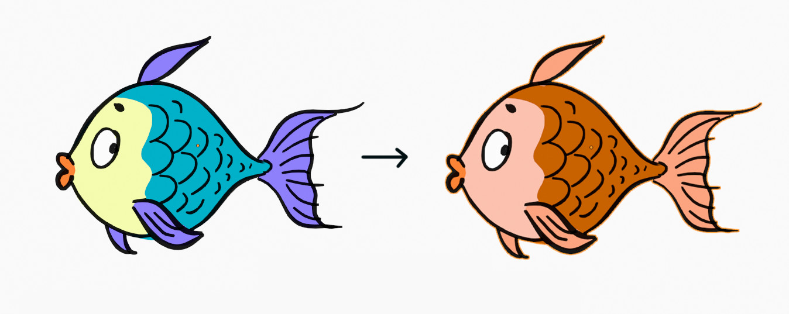

#### Exchange
Exchanges source color to target color

#### HSL
Hue / Saturation / Lightness sliders
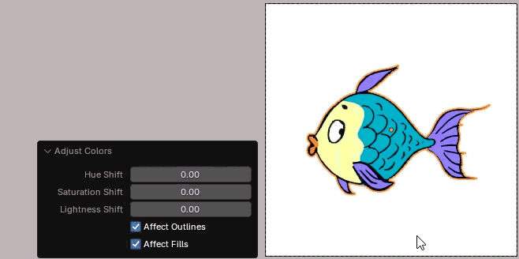
#### BC 
Brightness / Contrast sliders
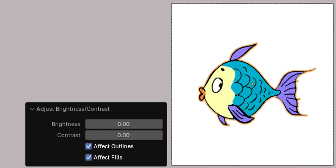

### Palette options

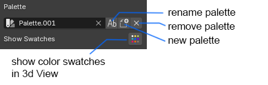

#### Create New Palette popup window

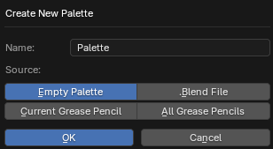

You can create:
- new empty palette
- palette based on visible grease pencil image
- import any palette from other .blend file

Example of palettes generated by 
**Create New Palette** -> **Current Grease Pencil**:
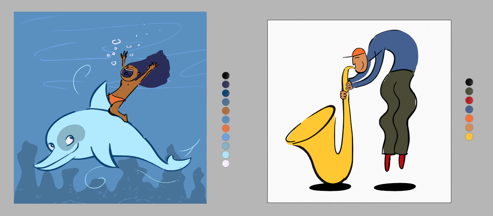

#### Show Swatches toggle button 
With this button you can switch on/off palette swatches in 3d View
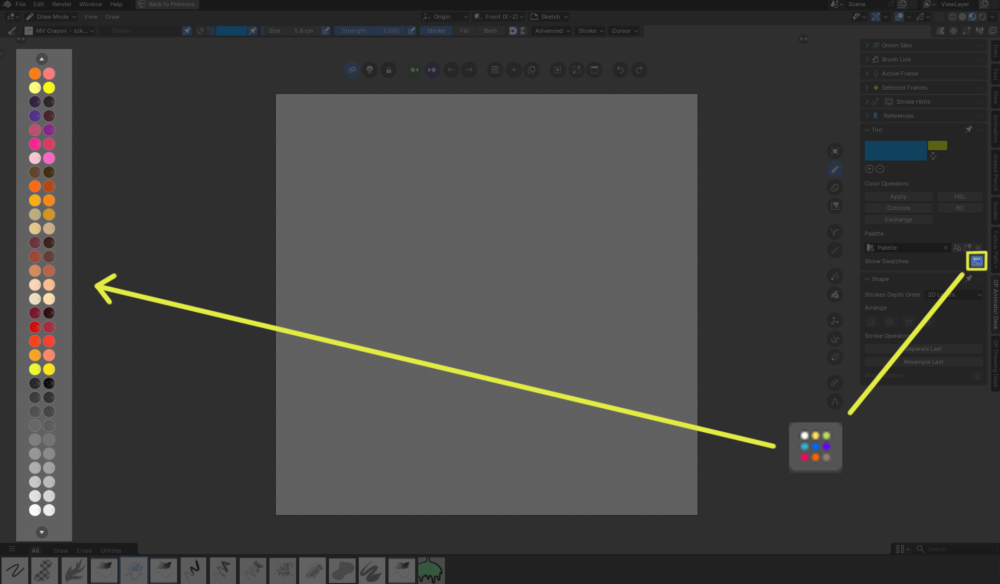

Use this swatches to change current brush color when in **Paint** mode or to fast change selected stroke colors when in **Edit** mode (with CONTROL key it changes fills, with SHIFT key it changes outlines).

## Shape panel

### Arrange
Arrange strokes in classic way, to change their order (works only in 2D Layers mode)
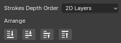

### Stroke operators
Additional stroke operators, in Edit mode they works on selected strokes, in other modes works on last drawn stroke (it makes life easier when you want to change last drawn stroke without going into **Edit** mode)
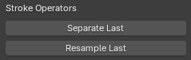

#### Separate 
Separates strokes into new Grease Pencil object. Works better than default Separate operator. 

#### Resample
Makes Simplify and Smooth operator on stroke to make it more regular, with option to close stroke. This prepres stroke for better sculpting.
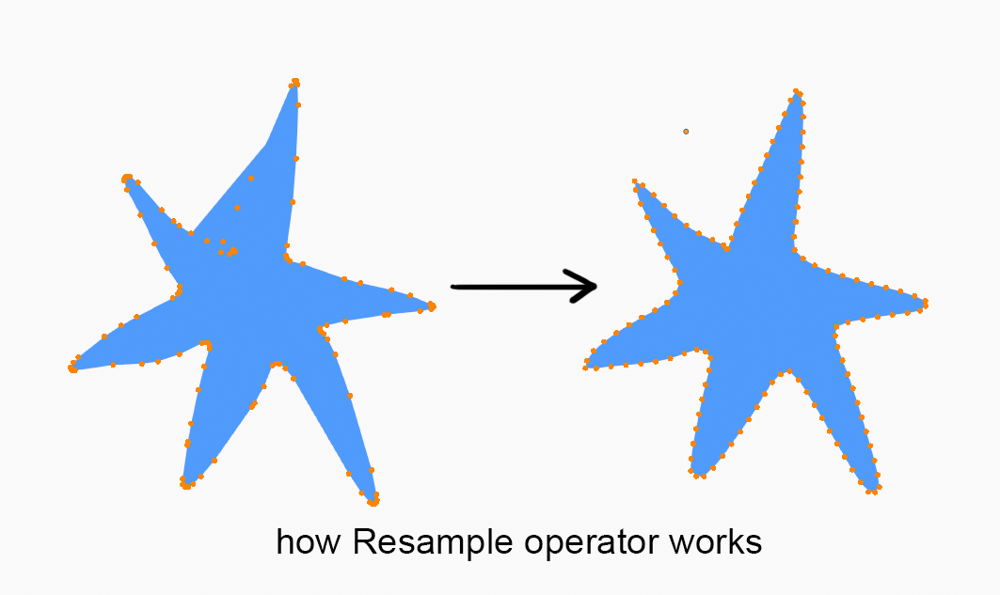

### Show Gizmos buttons

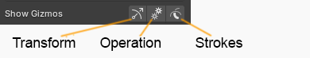
##### Transform 
Toggles classic 2D transform gizmos drawn around selection
##### Operation
Toggles Operation gizmos (Duplicate, Flip Horizontal, Flop Vertical, Delete buttons)
##### Strokes
Toggles native strokes viibility in Edit and Sculpt mode

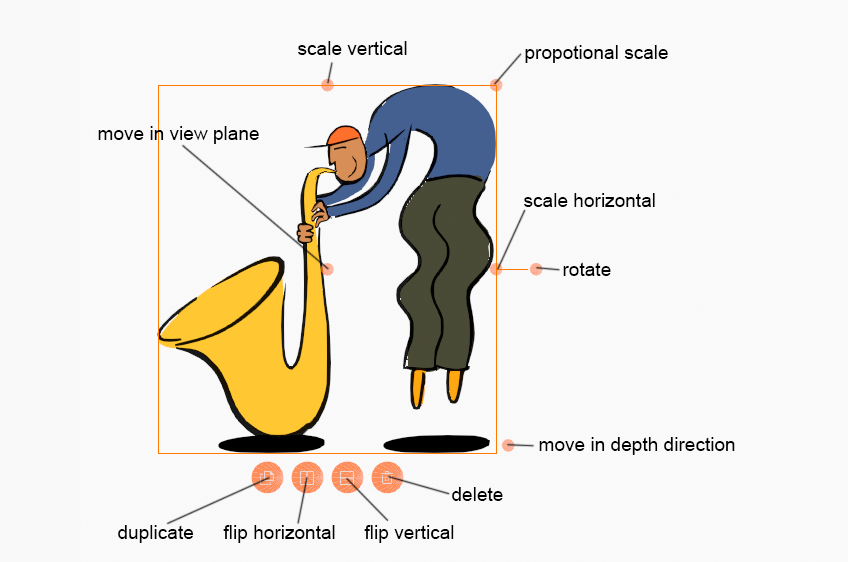

## Preferences

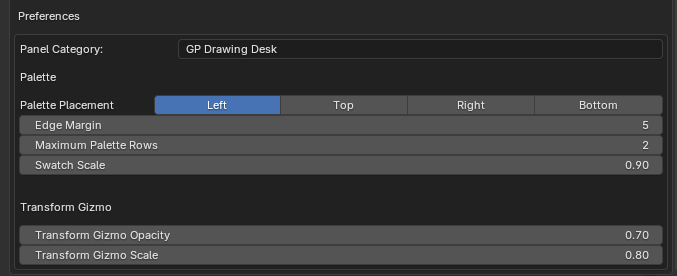